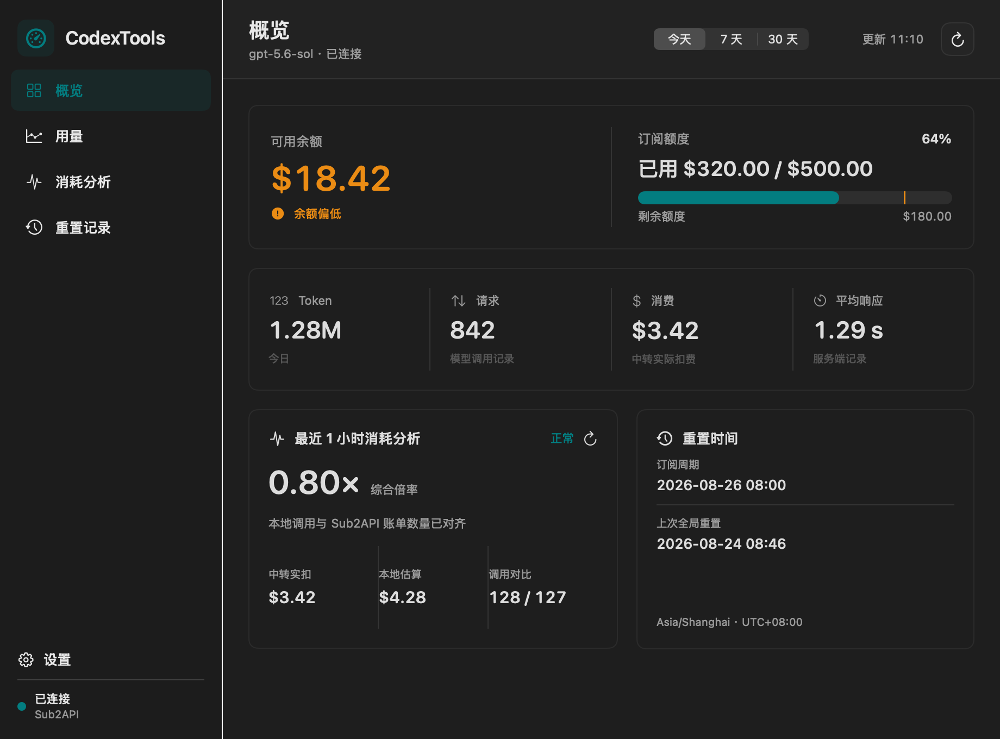

<!--
文件说明：CodexTools 项目说明与本地运行指南
作者：dingyi60(Codex)
创建时间：2026-08-25
-->

# CodexTools

CodexTools 是一个独立运行在 macOS 的 Sub2API 用量查看工具，提供完整操作窗口与菜单栏快捷面板，不依赖 Codex 或其他宿主应用。



## 当前能力

- 使用用户输入的 Sub2API 服务地址、邮箱和密码登录，不内置任何中转站地址。
- 将访问令牌和刷新令牌保存在 Keychain（macOS 系统安全凭据存储）中，不保存登录密码。
- 在主窗口和菜单栏悬浮层展示余额、订阅额度、Token（模型处理文本的计量单位）、请求数、消费金额、平均响应时间和最近使用模型。
- 统计周期默认“今天”，也可切换近 7 天或近 30 天，并按所选时区计算自然日范围。
- 菜单栏可显示紧凑 Token（例如 `1.28M`）、消费金额或两者；关闭两个选项后仅显示图标。
- 每小时读取 CC Switch 从本地 Codex 会话同步的调用与标准成本，对比 Sub2API 实际扣费并计算真实综合倍率。
- 支持按余额、剩余额度比例和新的社区重置事件发送 macOS 系统通知。
- 自动同步 codex-resets.com 的社区重置公告，并按用户选择的时区显示。

## 本地运行

```bash
./scripts/build_app.sh
open dist/CodexTools.app
```

打包脚本会生成本地临时签名的 `dist/CodexTools.app`。首次启用提醒时，macOS 会请求通知权限。应用提供主操作窗口，也可以从菜单栏随时快速查看用量。

## 验证

```bash
swift test
```

## 目录

- `Sources/CodexTools`：原生 SwiftUI（苹果声明式界面框架）应用。
- `Design/codextools-glass-concept.png`：玻璃界面概念规格图。
- `Design/codextools-glass-final-main.png`：最终主窗口预览。
- `Design/codextools-glass-final-menu.png`：最终菜单栏面板预览。
